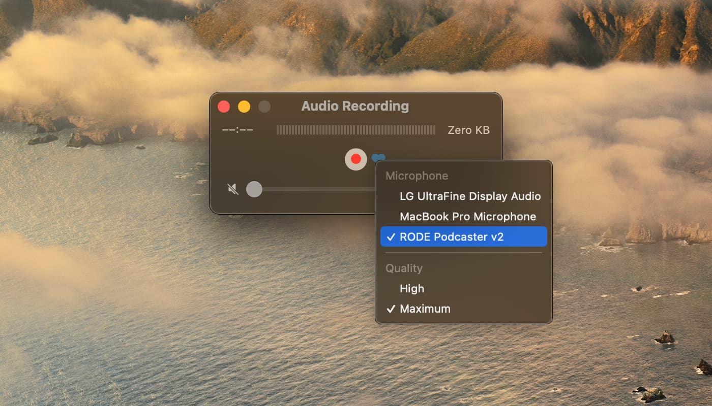

# Руководство для записи подкаста

Запись подкаста занимает в среднем около 1,5 часов, но лучше заложиться на 2 часа. Мы созваниваемся в Зуме, включаем камеры и видим друг друга, чтобы общение было живее. Каждый участник записывает свою дорожку, чтобы качество было лучше. Обычно мы записываемся днём в субботу и публикуем выпуск утром в понедельник.

## Подготовка

Для выпусков с гостями мы заводим отдельный чат в Телеграме, где заранее даём ссылку на черновик сценария и договариваемся о времени записи. Подготовка к записи делится на две части:

### Сценарий

Сценарий — это примерный набор идей и тем, которые мы будем обсуждать. Порядок тем нередко меняется, какие-то мы пропускаем, какие-то приходят по ходу. Перед записью мы обсуждаем и дополняем сценарий.

Как только появляется сценарий, можно начинать готовиться:

- Зайдите в сценарий выпуска и посмотрите как он устроен.
- Разберитесь в цветовом кодировании, найдите свой цвет.
- Проверьте, правильно ли записано ваше имя и фамилия.
- Добавьте ударение, если оно неочевидное и люди ошибаются.
- Подумате, как коротко представиться в начале.
- Добавьте ссылки на новости, статьи и проекты.
- Добавьте темы и идеи, которые вы хотели бы обсудить.
- Покрасьте ваши темы, идеи и ссылки в свой цвет.

### Новости

В пятницу в сценарии появляются новости и события недели, которые мы будем обсуждать в выпуске:

- Добавьте новости недели, которые вам было бы интересно обсудить.
- Проглядите новости и статьи, которые предложили ведущие.
- Выберите интересное вам, прочитайте.

## Место

Найдите тихое и мягкое место для записи, где вам никто не помешает.

### Тихое

Тихое — значит, что там не шумит кондиционер, холодильник, улица из окна, не ходят люди. Записи могут помешать скрипящий стул или стол, слишком громкие вентиляторы ноутбука, соседи с ремонтом. Постарайтесь этого избежать, выключить или изолировать на время записи.

### Мягкое

Мягкое — значит, что в месте записи больше мягкого и круглого, чем твёрдого и прямого. В мягком месте может быть просто много предметов: книжные полки, мебель, картины на стенах, кровать с одеялами, открытый шкаф с вещами, шторы, стулья и столы.

Твёрдое место помешает вам записать хороший звук: там будет больше эха и ваш голос будет сложнее разобрать. Кафельная плитка, стеклянные стены и столы, ровные кирпичные стены, большие пустые помещения — это плохое место для записи.

Если у вас есть выбор, попробуйте найти комнату, где меньше эха. Зайдите в каждую и хлопните в ладоши: если эхо хлопка не звенит или звенит меньше, чем в других комнатах — это место лучше.

## Техника

Чтобы записаться в подкасте, вам понадобится микрофон и наушники. Встроенные микрофоны, к сожалению, не подойдут: их сложно расположить близко ко рту и они дают много лишних шумов. Любой внешний микрофон лучше встроенного, есть несколько основных типов таких микрофонов.

### Гарнитуры

Проводная гарнитура от телефона — самый доступный вариант: это и наушники, и микрофон, которые можно легко воткнуть в ноутбук. Осторожно! Беспроводные наушники работают значительно хуже: они могут разрядиться, потерять сигнал и звучат не так хорошо.

Минус гарнитуры с микрофоном на проводе в том, что она свободно свисает и может цепляться за одежду, стол или даже незаметно оказаться у вас руках. Попробуйте этого избегать, как минимум, пока вы говорите.

Есть более удобные проводные гарнитуры в виде наушников с дужкой и отдельным микрофоном, как у сотрудников колл-центров или геймеров. Они лучше тем, что микрофон находится ближе ко рту и его сложнее случайно задеть.

### USB-микрофоны

Даже недорогой USB-микрофон может сильно улучшить качество звука. В отличие от гарнитур, такие микрофоны более точно передают ваш голос.

С такими микрофонами вам нужно иметь отдельные наушники, чтобы слышать других участников записи. Если вывести звук на колонки ноутбука, качество вашей записи будет сильно хуже, а монтаж усложнится.

При возможности, наушники лучше подключить прямо к микрофону — на них часто бывает мини-джек. В таком случае, вам нужно настроить микрофон в качестве входа и выхода для звука в вашей ОС.

Если мини-джека на микрофоне нет или что-то не получается, вы можете подключить наушники непосредственно к ноутбуку. Убедитесь в настройках ОС, что звук входит через микрофон и выходит через наушники.

Если у вас есть выбор, то лучше взять динамический USB-микрофон, чем конденсаторный. Динамический микрофон менее чувствителен к эху и посторонним шумам в неподготовленных помещениях.

Хорошие динамические USB-микрофоны:

- [Audio-Technica ATR2100x](https://www.audio-technica.com/en-us/atr2100x-usb)
- [Audio-Technica AT2005](https://www.audio-technica.com/en-us/microphones/wired/type/usb/at2005usb)
- [Samson Q2U](http://www.samsontech.com/samson/products/microphones/usb-microphones/q2u/)
- [Shure mv7](https://www.shure.com/en-US/products/microphones/mv7?variant=MV7-K)

Но и конденсаторный USB-микрофон лучше, чем гарнитура и тем более, чем встроенный микрофон.

## Запись

Каждый из участников выпуска записывает свою дорожку. Это помогает сохранить максимальное качество для монтажа и оставляет простор для обработки, чтобы проще было прибрать шумы и эхо. Дорожку важно записать и сохранить в максимально высоком качестве, чтобы в результате получился файл WAV, AIFF или подобные — то есть без сжатия.

### Windows

На Windows есть следующие программы для записи:

- [Audacity](https://www.audacityteam.org) — предпочтительно
- [Windows Voice Recorder](https://www.microsoft.com/p/windows-voice-recorder/9wzdncrfhwkn) — тоже сойдёт

### macOS

В macOS встроен медиаплеер QuickTime, который умеет записывать звук.

Важно выбрать правильный источник звука и максимальное качество.

## После

- Назовите файл дорожки вашим именем.
- Заархивируйте файл и киньте его загружаться в чат.
- Добавьте ссылки на вещи, которые всплыли во время записи.
- Добавьте ваш Твиттер, опционально сайт, проекты, профили.
- Скиньте портретные фотографии для обложки файлами в чат.

### Фотография

Ваша фотография для обложки должна быть портретного типа: взгляд в камеру, лучше вертикальная, чтобы в кадр попадало не только лицо, но и торс. Нужен исходник из телефона или камеры, чтобы можно было кропнуть и обработать — значит в чат фотографию нужно скинуть файлом, чтобы она не сжалась по дороге.

Если есть несколько таких фотографий — кидайте все, мы выберем. Если у вас нет такой фотографии, то сделайте её сами: подойдите к окну ранним днём и сделайте селфи или попросите вас сфотографировать. Этого обычно более чем достаточно для хорошей обложки.
